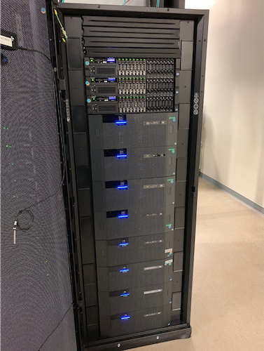
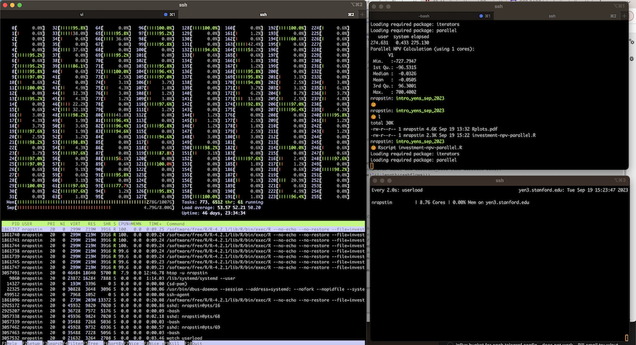

# Welcome to RCpedia

RCpedia is a place to learn how to solve Research Computing tasks at Stanford GSB[.](./assets/images/narwhal04.png) 

!!! warning
    All the Yen servers are scheduled for a routine reboot next Thursday, July 25, 2024. During the downtime, the servers will be patched and updated, and logins are disabled. The machines are scheduled to cycle roughly every two months, and the downtime dates are posted on the message of the day when you log in to the Yens. Please complete any jobs and log out of the Yens before the reboot. If you have any questions or concerns, please send a Slack message or contact us at [gsb_darcresearch@stanford.edu](gsb_darcresearch@stanford.edu).

Ain't it sexy?

## Current Yen Systems Status
<iframe class="airtable-embed" src="https://airtable.com/embed/shrS3FLv2TnfNDHgx?backgroundColor=red"
        frameborder="0" onmousewheel="" width="100%" height="500"
        style="background: transparent; border: 1px solid #ccc;"></iframe>

## Recent Changes
This whole dang website is brand spankin' new.

-  <a href="/path-to-yens-page">
    
     **Access the Yens** 
</a>

    ---

-   <a href="https://airtable.com/appNMWwjLLoCFxCpH/shr99dFma7Nf5S0yY">
    
     **Submit Project Request** 
</a>

    ---

    Submit a project to the DARC team for assistance with data analysis, research design, and more

  

-   <a href="https://airtable.com/appNMWwjLLoCFxCpH/shrbxt3IpoJFRqYU0">
    
     **Project Space Request** 
</a>

    ---

    Get dedicated storage space for your research project. 

    ---
    Please be nice

-   <a href="/path-to-yens-page">
    
     **Join the Slack Channel** 
</a>

    ---

    Join the DARC Slack channel to ask questions, share resources, and connect with other researchers.

## About Us
RCpedia is written and maintained by the Research Hub [DARC (Data, Analytics, and Research Computing) group](https://www.gsb.stanford.edu/faculty-research/darc). In addition to supporting research computing, the DARC team engages directly with faculty members preparing large-scale datasets, assisting with data analysis, and consulting on research design.
